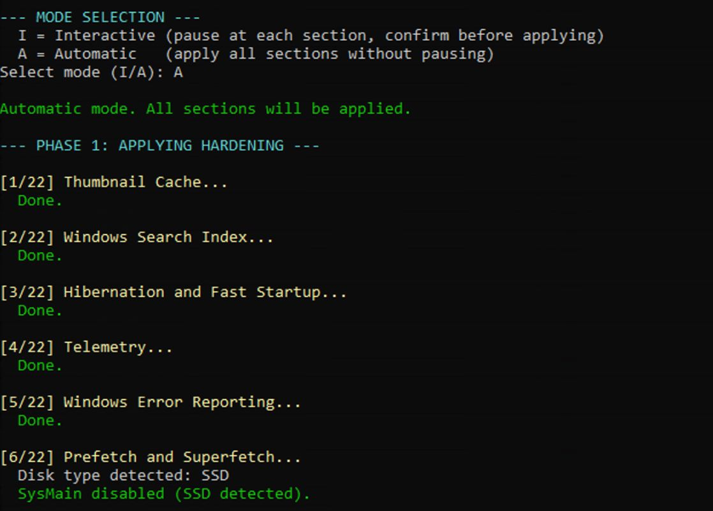

# Harden-Windows-Portable-Documented

A portable, fully documented Windows hardening script that works on any Windows machine without modification. Drop it on a machine, run it as Administrator, and it self-configures everything from the environment.

---

## TL;DR

I created this because I got fed up with manually setting up my own and friends' and family's local accounts.

Run this script as Administrator on any Windows machine. It will auto-detect the admin account, machine name, and OneDrive path. It takes a pre-change backup before touching anything, applies 22 hardening sections to every user profile on the machine, verifies the result, installs Windows and application updates, registers two weekly maintenance tasks, and produces a colour-coded summary at the end.

It has two modes: automatic or interactive. Automatic runs through everything after a couple of confirmations, whereas interactive mode lets you step through each change and approve or skip it individually.

<p align="center">
  
</p>

---

## Features

- **Fully portable** - no hardcoded usernames, paths, or machine names. Works on any Windows machine.
- **Applies to every account** - machine-wide policy keys cover all users, and the per-user settings are written to every local user profile plus the Default profile template, so accounts you create later inherit them. Profiles of users who are not signed in are loaded temporarily from `NTUSER.DAT`.
- **Interactive or Automatic mode** - step through each section with full documentation, or apply everything unattended.
- **Pre-change backup** - captures machine and per-user registry state, Group Policy report, security policy, audit policy, service states, hibernation and power plan, NetBIOS settings, telemetry task states, DNS servers and DoH registrations before making any change. Stored in a dated subfolder and copied to `PRE-CHANGE-LATEST` for quick access.
- **Rollback capability** - if a previous run's pre-change backup exists, the script offers to restore everything in that backup before proceeding. See [Rollback](#rollback) for what is and is not covered.
- **Interruption protection** - Windows Update service is suspended during the run to prevent forced reboots mid-session. A progress log is written after each section. If interrupted, the next run detects the incomplete log and offers to resume from the last completed section.
- **Post-hardening verification** - independently checks every key control after applying changes and flags any drift.
- **Debloating** - removes and deprovisions consumer Store apps (Xbox, LinkedIn, Bing News/Weather, Solitaire, Clipchamp, Skype, Phone Link, consumer Teams Chat, and more) plus disables Cortana, in-OS ads, suggested content, the advertising ID, and Widgets. Work apps (Microsoft 365, Teams for work, Company Portal) are left untouched.
- **Windows Update integration** - installs OS patches via PSWindowsUpdate and upgrades all third-party applications via winget immediately after hardening.
- **Weekly scheduled tasks** - registers `WindowsAdminBackup` (Sunday 08:00, runs as SYSTEM) and `WeeklyWingetUpgrade` (Sunday 09:00, runs as the admin account) with `StartWhenAvailable` so missed runs catch up. The backup script is written automatically to `C:\ProgramData\Maintenance-Stuff`, a folder only SYSTEM and Administrators can modify, so nothing that runs as SYSTEM is ever loaded from a user-writable or OneDrive-synced location.
- **Colour-coded summary table** - every section, its status, and all verification results displayed clearly at the end.
- **Free space wipe (disk-aware)** - optional `cipher /w:C` at the end to overwrite deleted file remnants. The script auto-detects the C: disk type and recommends against the wipe on SSDs (defaulting the prompt to skip), while offering it as a sensible option on HDDs.

---

## Requirements

- Windows 10 or Windows 11 (OS-level DNS over HTTPS is Windows 11 only)
- Windows PowerShell 5.1 (included in Windows). Run it from Windows PowerShell, not PowerShell 7: the WMI and Appx cmdlets the script relies on are absent or behave differently in PowerShell 7.
- Administrator account (the script refuses to start otherwise)
- Internet access (for PSWindowsUpdate and winget upgrade phases)

---

## How to Use

1. Download `Harden-Windows-Portable-Documented.ps1`
2. Copy it to the machine you want to harden
3. Open Windows PowerShell as Administrator
4. Run the following commands:

```powershell
Unblock-File .\Harden-Windows-Portable-Documented.ps1
Set-ExecutionPolicy RemoteSigned -Scope CurrentUser
.\Harden-Windows-Portable-Documented.ps1
```

5. Review the auto-detected machine context displayed at startup
6. Choose whether to restore from a previous pre-change backup if one exists
7. Confirm you want to proceed
8. Select **I** for Interactive mode or **A** for Automatic mode
9. Follow the prompts

---

## What It Does

The script runs in five phases plus a final step.

### Phase 0 - Detect
Auto-detects the admin username, profile path, machine name, and OneDrive path from environment variables. Creates the Maintenance-Stuff folder if it does not exist. Captures a full pre-change backup. Checks for an incomplete previous run and offers to resume.

### Phase 1 - Apply (22 sections)

| Section | What it does |
|---|---|
| 1. Thumbnail Cache | Disables Explorer thumbnail database via machine policy. Clears existing cache files for every profile. |
| 2. Windows Search Index | Disables WSearch service. Deletes Windows.edb index database. |
| 3. Hibernation and Fast Startup | Runs `powercfg /h off`. Disables HiberbootEnabled. Removes hiberfil.sys. |
| 4. Telemetry | Sets AllowTelemetry to 0. Stops and disables DiagTrack. Clears queued telemetry. |
| 5. Windows Error Reporting | Disables WerSvc. Clears ReportArchive, ReportQueue, and crash dumps. |
| 6. Prefetch and Superfetch | Disables EnablePrefetcher and EnableSuperfetch. Stops SysMain. Clears Prefetch folder. |
| 7. Recent Files and Jump Lists | Disables Start_TrackDocs and clears Recent, AutomaticDestinations, CustomDestinations for every profile. Removes common orphaned Run keys (machine and per-user). |
| 8. Location Tracking | Disables DisableLocation via policy. Clears LocationHistory folder. |
| 9. Delivery Optimisation | Sets DODownloadMode to 0 (HTTP-only, no peer-to-peer). Leaves DoSvc running since Windows Update depends on it for downloads. Clears DO cache. |
| 10. Activity History and CDP | Disables activity feed policy keys. Stops CDPSvc. Disables CDPSvc via registry. Deletes ConnectedDevicesPlatform folder. |
| 11. Windows Ink and Handwriting | Disables AllowWindowsInkWorkspace. Clears InputPersonalization data. |
| 12. Network Hardening | Disables LLMNR via EnableMulticast=0. Disables NetBIOS on all adapters via WMI SetTcpipNetbios(2). |
| 13. Power Plan | Applies Ultimate Performance on desktops, High Performance on laptops. Auto-detects via WMI Win32_Battery. |
| 14. Scheduled Task Cleanup | Removes SoftLanding OEM tasks and CCleanerSkipUAC if present. |
| 15. Service Dependencies | Protects OneDrive sync services, VMware, and YubiKey smart card services from being accidentally disabled. |
| 16. Audit Policy Baseline | Enables logon/logoff, account lockout, privilege use, policy change, and account management auditing. |
| 17. DNS over HTTPS | Windows 11 only. Registers Cloudflare 1.1.1.1 and 1.0.0.1 with their DoH template and auto-upgrade, sets the "Configure DNS over HTTPS" policy to Allow, and points active physical adapters at Cloudflare. Plaintext fallback is kept so captive portals still work. Confirm after reboot with `netsh dns show encryption`. |
| 18. Cortana and Web Search | Disables Cortana via policy. Turns off Bing/web results and connected search in the Start menu. |
| 19. Local Account Security Questions | Sets NoLocalPasswordResetQuestions=1, removing the offline password-reset backdoor for local accounts. |
| 20. Consumer Bloatware Removal | Removes for all users and deprovisions Xbox suite, LinkedIn, Bing News/Weather, Solitaire, Clipchamp, Groove/Movies, 3D apps, Skype, Maps, Phone Link, consumer Teams Chat, Get Help, Tips, Feedback Hub, Mixed Reality, People. |
| 21. Consumer Experiences and Ads | Disables auto-installed promoted apps, suggested content, lock-screen Spotlight ads, advertising ID, tailored experiences, and the Widgets/News feed. Per-user toggles applied to every profile. |
| 22. Additional Telemetry Hardening | Disables CEIP and Application Experience scheduled tasks, App Compat Appraiser/Inventory, feedback sampling, and online speech/inking-and-typing data collection. Per-user toggles applied to every profile. |

### Phase 2 - Verify
Independently checks all key controls and flags any that did not apply correctly. Checks include service startup types, registry values, DoH policy and server registration, and BitLocker status. Enabled non-Microsoft scheduled tasks are listed for review but are not counted as failures.

### Phase 3 - Backup
Exports post-hardening registry keys, Group Policy report, security policy, and services state CSV. Writes a README with verification results and restore procedure.

### Phase 4 - Tasks
Registers `WindowsAdminBackup` (Sunday 08:00, runs as SYSTEM) and `WeeklyWingetUpgrade` (Sunday 09:00, runs as the admin account that ran the script). Both use `StartWhenAvailable`. The backup script is written to `C:\ProgramData\Maintenance-Stuff` with permissions that stop standard users and OneDrive sync from modifying it, and the backup destination is passed to it as an argument because SYSTEM has no OneDrive path of its own. The winget task runs as the admin user rather than SYSTEM because `winget` is a per-user app alias that SYSTEM cannot resolve.

### Phase 5 - Update
Installs PSWindowsUpdate module if not present. Applies all pending Windows OS and driver patches. Runs `winget upgrade --all` for third-party applications.

### Final - Cipher Wipe
Auto-detects the C: disk type via WMI. On an **SSD** it recommends against the wipe and defaults the prompt to skip (wear-leveling and TRIM make the overwrite unreliable and it adds needless write wear - rely on BitLocker, or a vendor secure-erase for disposal). On an **HDD** it offers `cipher /w:C` to overwrite deleted file remnants. Can be deferred and run manually.

---

## Output Files

All output is written to `Maintenance-Stuff` inside the admin's OneDrive Documents folder. If OneDrive is not present, falls back to `C:\Maintenance-Stuff`.

```
Maintenance-Stuff\
  2026-04-26\
    PRE-CHANGE\
      Registry_M_*.reg         ← pre-hardening machine registry snapshots
      Registry_U_*_<SID>.reg   ← pre-hardening per-user registry snapshots, one set per profile
      Registry_State_PRE.csv   ← per-value existence tracking for smart rollback
      GroupPolicy_Report_PRE.html
      SecurityPolicy_PRE.cfg
      AuditPolicy_PRE.csv      ← auditpol subcategory backup
      Services_State_PRE.csv
      Misc_State_PRE.csv       ← hibernation state and active power plan
      NetBIOS_PRE.csv          ← NetBIOS setting per adapter
      ScheduledTasks_PRE.csv   ← state of the telemetry tasks Section 22 disables
      DnsClientServerAddress_PRE.csv
      DohServers_PRE.csv       ← DoH server registrations (Windows 11)
      README.txt
    Registry_*.reg             ← post-hardening registry snapshots
    GroupPolicy_Report.html
    SecurityPolicy.cfg
    Services_State.csv
    README.txt
  PRE-CHANGE-LATEST\           ← copy of most recent pre-run state for rollback
  hardening-progress.log       ← section completion log for resume capability
  winget-upgrade-log.txt       ← weekly winget upgrade output

C:\ProgramData\Maintenance-Stuff\
  Backup-WindowsAdmin.ps1      ← auto-generated backup script run weekly as SYSTEM
                                  (folder writable by SYSTEM and Administrators only)
```

---

## Rollback

If something goes wrong after hardening, re-run the script. It will detect the `PRE-CHANGE-LATEST` folder and offer to restore:

- Machine and per-user registry keys, for every profile (only removes keys/values that did not exist before hardening)
- Security policy via secedit, and audit policy subcategories via auditpol
- Service startup types via registry Start values
- Hibernation, the active power plan, and NetBIOS per adapter
- The telemetry scheduled tasks Section 22 disabled, DNS server addresses per adapter, and DoH server registrations

Not restored: file deletions (thumbnail cache, prefetch, WER dumps, activity history), removed Store apps (reinstall from the Microsoft Store if needed), the OEM and CCleaner tasks removed by Section 14, and the two weekly maintenance tasks this script registers (remove them in Task Scheduler if not wanted). Full disk encryption via BitLocker provides the stronger guarantee for data at rest.

---

## What Is Not Hardened

The following are deliberately omitted from this script because they would break legitimate software or require manual configuration specific to each machine:

- **BitLocker** - must be enabled manually via Settings > Privacy & Security > Device Encryption
- **Windows Firewall rules** - network-specific and not portable
- **User Account Control level** - left at system default
- **Microsoft Defender settings** - left at system default
- **Browser hardening** - browser-specific and not portable

---

## Scheduled Tasks Registered

| Task name | Schedule | Runs as | Purpose |
|---|---|---|---|
| WindowsAdminBackup | Every Sunday 08:00 | SYSTEM | Exports registry, GPO, security policy, and service state to Maintenance-Stuff |
| WeeklyWingetUpgrade | Every Sunday 09:00 | The admin account that ran the script | Upgrades all winget-managed packages |

Both tasks use `StartWhenAvailable`. If the machine is off at the scheduled time, the backup task runs on the next startup and the winget task runs the next time that admin account is signed in. To exclude an application from unattended upgrades, pin it with `winget pin add --id <PackageId>`.

---

## Compatibility

Tested on Windows 11 Pro. Compatible with Windows 10 and Windows 11 Home and Pro. Some sections behave differently by edition or version: BitLocker verification is reported as a note rather than a failure on Home editions, the Ultimate Performance power plan is created if absent, and OS-level DNS over HTTPS (Section 17) is skipped with a warning on Windows 10. All sections handle missing features gracefully via `-ErrorAction SilentlyContinue`.

---

## Important Notes

- Run as Administrator from Windows PowerShell 5.1. The script refuses to start without elevation.
- Per-user settings are applied to every profile on the machine, including the Default template. Profiles of users who are not signed in are loaded from `NTUSER.DAT` for a few seconds each; avoid having someone sign in while the script is running.
- Do not run this script on machines managed by Microsoft Family Safety. It will break parental controls. Use the companion script `Maintain-ChildAccount-Portable` instead.
- Do not run this script on corporate-managed machines without checking Group Policy first. Enterprise GPO may override or conflict with some settings.
- A reboot is recommended after the script completes, particularly after the DNS over HTTPS and Delivery Optimisation sections.
- Section 19 disables local-account security questions. If you rely on the login-screen question reset for a local account, keep an alternative recovery route (a second admin account, or the password recorded in a password manager) before applying.
- Windows Copilot is intentionally **not** disabled by this script. Add it separately if your build requires it.

---

## Safety Notice

This script modifies Windows configuration. Review it before use and test on non-critical systems first. No warranty is provided.

---

## Licence

MIT. See [LICENSE](LICENSE).
